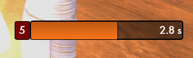
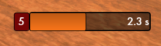
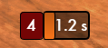

# DBCooper
SWL Addon for tracking Dragon's Breath debuff stacks

A limitation in the game's API prevents addons like EffectsUI from discriminating between identical debuffs applied by different players. For example, if two players are stacking Dragon's Breath on a target, the EffectsUI display (and to a lesser extent the default in-game display) will change which player's debuff information is displayed.

This addon circumvents that issue and displays only your own Dragon's Breath stacks. 

By default, the display looks like the screenshot below, showing the number of stacks in a red box and the timer on the current stack as a bar display.

 

## Customization
However, the dsiplay can be customized using slash commands. To change the horizontal width of the bar, use

`/setoption dbc_width #`

The default width is 250 pixels. Below are screenshots taken after changing the width using the following commands.

`/setoption dbc_width 200`

 

`/setoption dbc_width 50`

 

The height of the bar can be changed by adjusting the font size with

`/setoption dbc_fontsize #`

The default font size is 16.
